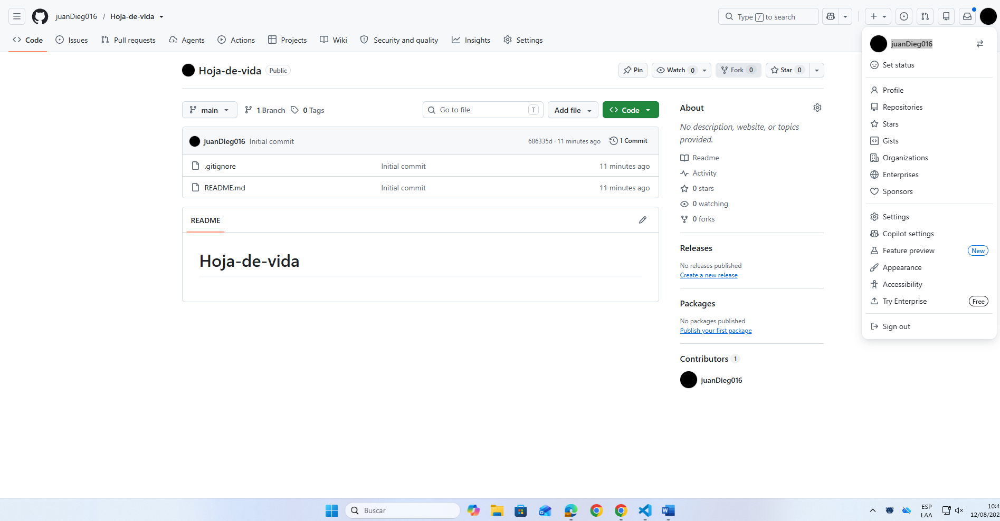
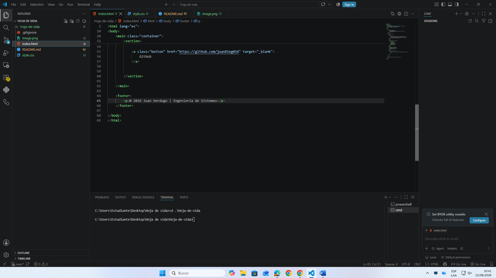
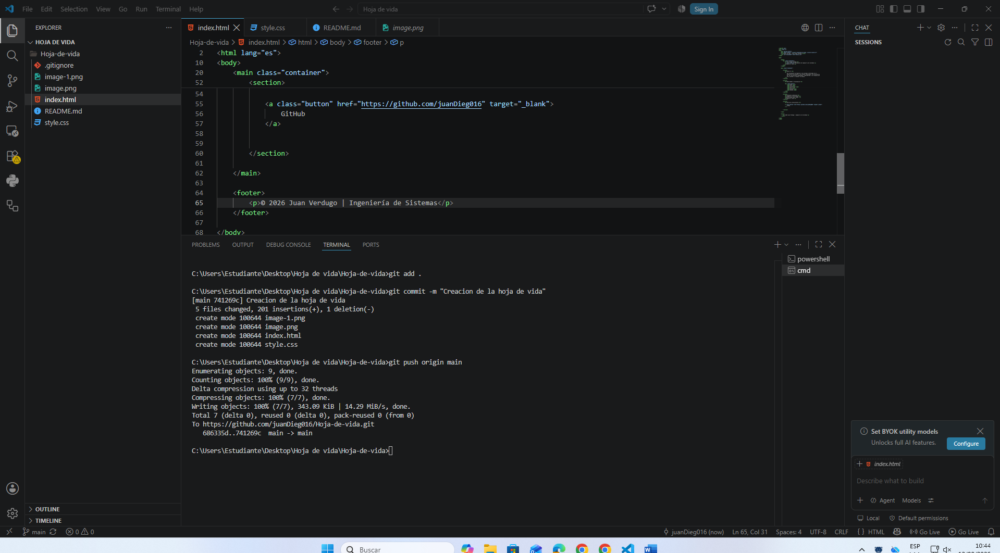
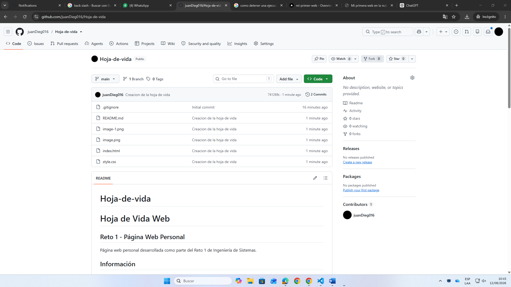

# Hoja-de-vida
# Hoja de Vida Web

## Reto 1 - Página Web Personal

Página web personal desarrollada como parte del Reto 1 de Ingeniería de Sistemas.

## Información

- Nombre: Juan Diego Verdugo
- Carrera: Ingeniería de Sistemas
- Semestre: 6
- Tecnologías: HTML, CSS, JavaScript, Git y GitHub

## Tecnologías utilizadas

- HTML5
- CSS3
- Git
- GitHub
- Vercel

## Evidencias
1.
2.
3.

### Repositorio en GitHub

### Página desplegada en Vercel

## URL final

https://tu-proyecto.vercel.app